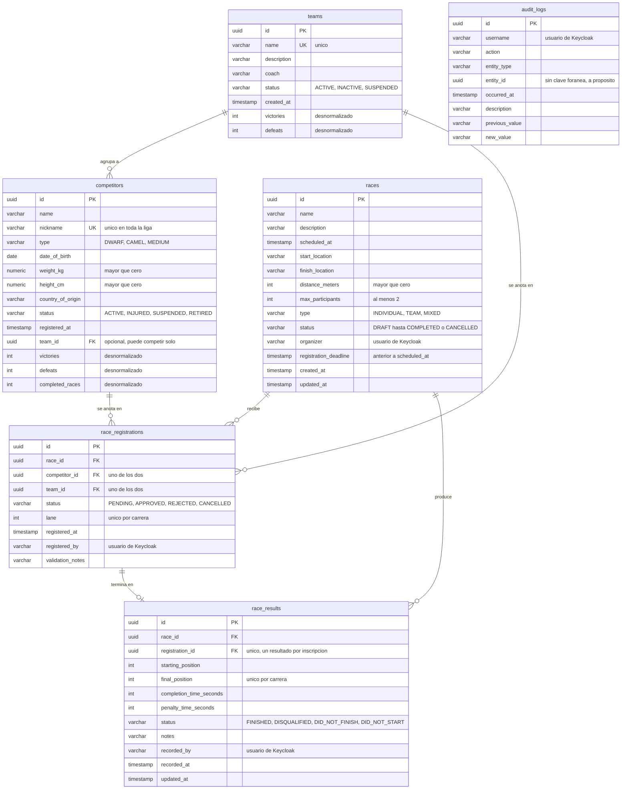

# El modelo de datos

Seis tablas. Cinco son el dominio de la liga y la sexta es la bitácora, que no se
relaciona con ninguna otra a propósito.

El esquema lo crea Flyway, no Hibernate: las migraciones están en
`src/main/resources/db/migration` y son la única fuente de verdad. Hibernate
arranca con `ddl-auto: validate`, así que si una entidad de Java deja de coincidir
con la tabla, la aplicación no levanta.

## El diagrama



## No hay tabla de usuarios

Es lo primero que llama la atención del diagrama, y es deliberado. Los usuarios
viven en Keycloak, que es quien guarda las contraseñas, las cifra y emite los
tokens. La aplicación nunca ve una contraseña: recibe un token ya firmado y
verifica la firma.

Por eso `organizer`, `registered_by`, `recorded_by` y `audit_logs.username` son
texto y no claves foráneas. Guardan el nombre de usuario tal como venía en el
token en el momento de hacer la operación. Tiene una ventaja concreta sobre una
clave foránea: si mañana alguien se va de la liga y se borra su usuario de
Keycloak, la bitácora sigue diciendo quién canceló aquella carrera. Una clave
foránea habría que borrarla o dejarla apuntando al vacío.

## La inscripción es de un competidor o de un equipo, nunca de los dos

`race_registrations` tiene dos claves foráneas opcionales, `competitor_id` y
`team_id`, y una restricción que obliga a que exactamente una esté completa:

```sql
CHECK ((competitor_id IS NOT NULL AND team_id IS NULL)
    OR (competitor_id IS NULL AND team_id IS NOT NULL))
```

La alternativa habría sido dos tablas de inscripción, una por tipo de
participante. Se descartó porque todo lo demás —el carril, el cupo, el estado,
el resultado— es idéntico en los dos casos, y duplicar la tabla obligaría a
duplicar también `race_results` o a ponerle dos claves foráneas. Con una sola
tabla, un resultado pertenece a *quien figure en la inscripción*, y esa es
justamente la regla del reglamento: si corrió un equipo, la victoria es del
equipo y no se reparte entre sus integrantes.

## Tres restricciones únicas que hacen bastante trabajo

`uk_registrations_race_lane` sobre `(race_id, lane)` impide que dos participantes
salgan del mismo carril. Lo interesante es que el carril puede quedar en `NULL`
mientras la inscripción está pendiente, y Postgres permite varios `NULL` dentro de
una restricción única. Así conviven veinte inscripciones sin carril asignado y,
apenas se aprueban, la base garantiza que no se pisen.

`uk_results_race_position` sobre `(race_id, final_position)` es la que impide dos
ganadores en la misma carrera. El servicio también lo valida, para poder dar un
mensaje entendible, pero la garantía está acá: aunque dos organizadores carguen el
primer puesto al mismo tiempo, la base rechaza al segundo. Y por el mismo motivo
que arriba, los que no terminaron llevan `final_position` en `NULL` y pueden ser
varios sin molestarse entre sí.

`uk_results_registration` asegura que cada inscripción tenga a lo sumo un
resultado. Sin ella, cargar dos veces el resultado de la misma persona dejaría a
la carrera con más llegadas que corredores y a las estadísticas contando de más.

## La coherencia del resultado, en la base

```sql
CHECK ((status = 'FINISHED'  AND final_position IS NOT NULL AND completion_time_seconds IS NOT NULL)
    OR (status <> 'FINISHED' AND final_position IS NULL     AND completion_time_seconds IS NULL))
```

Un participante que terminó tiene puesto y tiempo. Uno que abandonó, que fue
descalificado o que no largó no tiene ninguno de los dos, y no es lo mismo que
tenerlos en cero: un tiempo de cero segundos diría que llegó instantáneamente.
Escribirla como restricción evita que un `NULL` mal puesto arme una fila que la
aplicación después no sabe interpretar.

## Estadísticas desnormalizadas

`competitors` y `teams` guardan `victories`, `defeats` y `completed_races`, que
son datos que podrían calcularse recorriendo `race_results`. Están duplicados a
propósito, porque se leen en cada listado y en cada ficha, y hacer esa cuenta cada
vez significa recorrer todos los resultados históricos para mostrar un número al
costado de un nombre.

El riesgo conocido de desnormalizar es que los dos valores se separen. Se maneja
de una sola manera: cuando se carga o se corrige un resultado, el servicio
**recalcula el total desde cero** en lugar de sumarle uno al contador. Si se
incrementara, corregir un resultado dejaría la victoria vieja sumada para siempre.

La tabla de posiciones, en cambio, no usa estos campos: los calcula con `SUM` y
`CASE` en la consulta. Es al revés de lo que uno esperaría, y tiene su razón. La
clasificación necesita ordenar y paginar por puntos, y eso lo tiene que hacer la
base; además los puntos dependen del puesto, que solo está en `race_results`.

## La bitácora no se relaciona con nadie

`audit_logs.entity_id` guarda el identificador de la entidad tocada, pero **no es
una clave foránea**, y eso es a propósito por dos motivos. Uno, es polimórfica:
la misma columna apunta a veces a una carrera y a veces a un competidor, y una
clave foránea solo puede apuntar a una tabla. Dos, la bitácora tiene que
sobrevivir a lo que registra; si una fila desapareciera, el registro de que
alguien la borró se iría con ella.

Por la misma razón, `action` tampoco tiene una restricción `CHECK` con la lista de
valores. Agregar una acción nueva al enum de Java no debería requerir una
migración, y una bitácora que rechaza escrituras es peor que una bitácora con un
valor que todavía no conoce.

## Nada se borra de verdad

No hay ningún `DELETE` en la aplicación. Lo que la API expone como baja es un
cambio de estado: un competidor pasa a `RETIRED`, un equipo a `INACTIVE`, una
carrera a `CANCELLED`, una inscripción a `CANCELLED`.

El motivo es el historial. Si se borrara un competidor, habría que borrar sus
inscripciones y sus resultados, y con eso se caerían las posiciones de las
carreras en las que participó: los que salieron detrás de él pasarían a haber
salido un puesto más adelante. Un resultado histórico no cambia porque alguien se
retire.

## Los índices

Cada columna por la que se filtra tiene índice: los `status` y `type` de las
cuatro tablas, `scheduled_at` para ordenar la agenda, las claves foráneas de las
inscripciones y los resultados, y en la bitácora `occurred_at`, `username`,
`action` y el compuesto `(entity_type, entity_id)`.

No son gratis: cada índice ocupa espacio y hace un poco más lenta cada escritura.
Con el volumen de esta liga da igual, pero están puestos donde el patrón de
consulta lo justifica y no en todas las columnas por las dudas.
